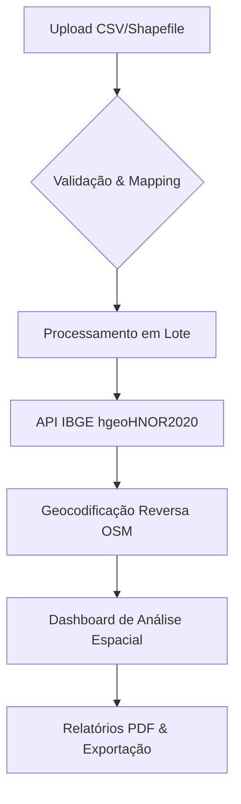

# GeoAlt | Enterprise Geodetic Solution 🌐

**GeoAlt** é uma plataforma de inteligência geográfica projetada para a conversão de alta precisão entre altitudes geométricas (GNSS) e ortométricas. Utilizando o motor oficial **hgeoHNOR2020** do IBGE, o sistema provê a ponte fundamental entre a medição satelital e a realidade física do terreno.

---

## 🏗️ Arquitetura e Fluxo de Dados

## 📐 Fundamentos Geodéticos

O GeoAlt resolve a complexidade da ondulação geoidal brasileira. Enquanto receptores GNSS medem a distância até o elipsoide matemático (**h**), projetos de engenharia exigem a altitude referenciada ao nível médio do mar (**H**).

**Equação Fundamental:**  
`H = h - N`

Onde:
- **H**: Altitude Ortométrica (Nível Médio do Mar / Imbituba)
- **h**: Altitude Geométrica (GNSS / SIRGAS2000)
- **N**: Ondulação Geoidal (Modelo hgeoHNOR2020)

## 🛡️ Privacidade e Segurança de Dados

O GeoAlt foi desenvolvido com foco absoluto em privacidade industrial:
- **Zero Data Retention**: Seus dados de coordenadas não são armazenados em nossos servidores.
- **Client-Side Heavy**: O processamento de arquivos (CSV/Shapefile) e a geração de relatórios ocorrem diretamente no seu navegador.
- **Transparência**: Conexões externas são realizadas exclusivamente com as APIs oficiais do IBGE e OpenStreetMap (Nominatim).

## 📊 Biblioteca de Gráficos (Frontend)

A visualização dos dashboards é construída com **React + Recharts**, com foco em leitura geoespacial e contexto topografico.

### Componentes Implementados

- **Perfil de Elevação (Perfil H)**
    - Eixo horizontal em distancia acumulada (km), calculada por Haversine
    - Camada dupla: **H** como area com gradiente e **h** como linha pontilhada
    - Exibe de forma visual a relacao geodesica entre h, H e ondulacao geoidal (N)

- **Planimetria (XY)**
    - Trajeto em coordenadas geograficas com colorizacao por altitude
    - Escala cromatica continua para reforcar mudancas altimetricas
    - Proporcao espacial ajustada para reduzir distorcoes visuais da rota

- **Polimento Visual**
    - Grid horizontal sutil (sem linhas verticais)
    - Destaque de ponto apenas no hover com tooltip tecnico
    - Nota tecnica orientando o uso do modo mapa para projecao cartografica fiel

### Referencia de Implementacao

- `src/components/StatsDashboard.tsx`

---

## 📜 Licença e Conformidade

Este software é distribuído sob a **Apache License 2.0**. Ele está em total conformidade com as normas técnicas brasileiras para georreferenciamento e topografia.

---
*GeoAlt - Precisão Milimétrica para Grandes Decisões.*
